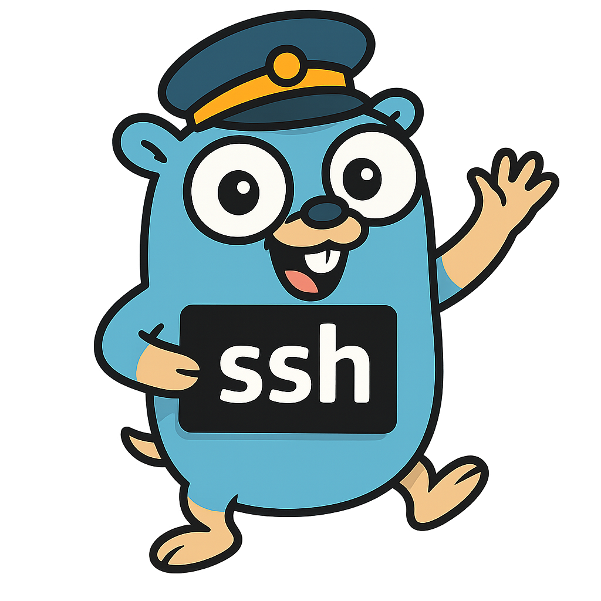

# Akumi

[](https://goreportcard.com/report/github.com/omegaatt36/akumi)
[](https://opensource.org/licenses/MIT)



Akumi is a Terminal User Interface (TUI) SSH connection manager written in Go. It provides a simple and intuitive interface for managing and connecting to SSH targets.

## Features

- **Simple TUI**: Easy-to-use interface built with [bubbletea](https://github.com/charmbracelet/bubbletea)
- **Target Management**:
  - List all configured SSH targets
  - Create new SSH targets (press `c`)
  - Edit existing targets (press `e`)
  - Delete targets with confirmation (press `d`)
- **Quick Navigation**:
  - Use arrow keys or vim-style `j`/`k` to navigate
  - Circular navigation through the target list
  - Quick connect with `Enter`
- **Flexible Configuration**:
  - YAML-based configuration
  - Optional custom ports
  - Optional nicknames for better organization
  - XDG-compliant config location

## Installation

```bash
go install github.com/omegaatt36/akumi@latest
```

## Configuration

Configuration file location: `$XDG_CONFIG_HOME/akumi/config.yaml` (defaults to `$HOME/.config/akumi/config.yaml`)

Example configuration:

```yaml
targets:
  - user: root
    host: 192.168.1.99
    nickname: dev-server
  - user: admin
    host: example.com
    port: 2222
    nickname: prod-db
  - user: deploy
    host: 10.0.0.50
```

## Usage

### Keyboard Controls

| Key           | Action                           |
|---------------|----------------------------------|
| `↑` or `k`    | Move selection up                |
| `↓` or `j`    | Move selection down              |
| `Enter`       | Connect to selected target       |
| `c`           | Create new target               |
| `e`           | Edit selected target            |
| `d`           | Delete selected target          |
| `q`           | Quit application                |
| `Ctrl+c`      | Force quit                      |

### Target Format Display

- With nickname: `[nickname] user@host[:port]`
- Without nickname: `user@host[:port]`

The port is only displayed when it's not the default value (22).

## Requirements

- Go 1.24 or later
- `ssh` command available in PATH

## Dependencies

- [charmbracelet/bubbletea](https://github.com/charmbracelet/bubbletea) - TUI framework
- [charmbracelet/bubbles](https://github.com/charmbracelet/bubbles) - TUI components
- [yaml.v3](https://gopkg.in/yaml.v3) - YAML support

## Contributing

Contributions are welcome! Please feel free to submit a Pull Request.

## License

MIT License - see [LICENSE](LICENSE) for details
